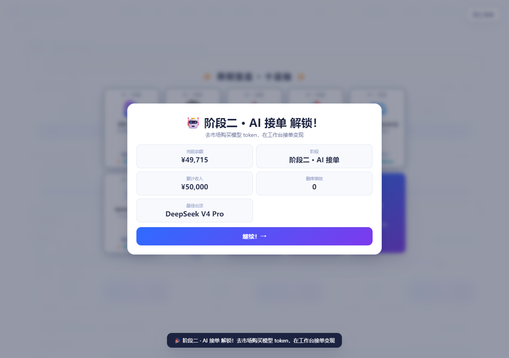
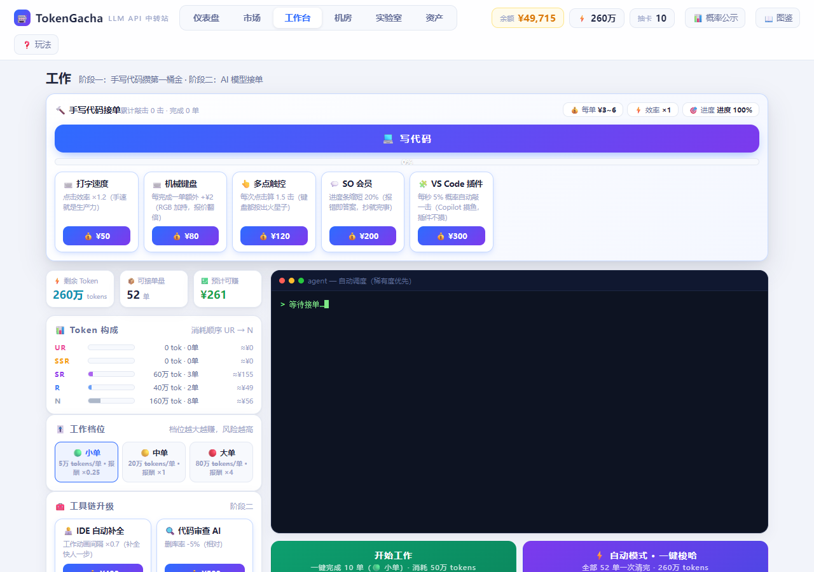
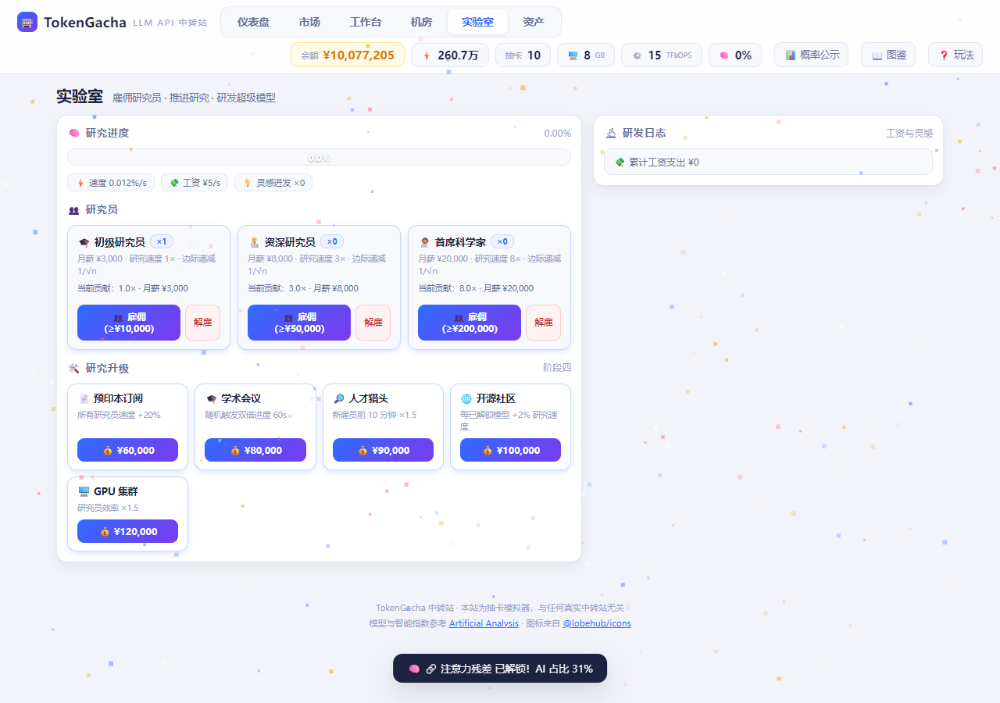
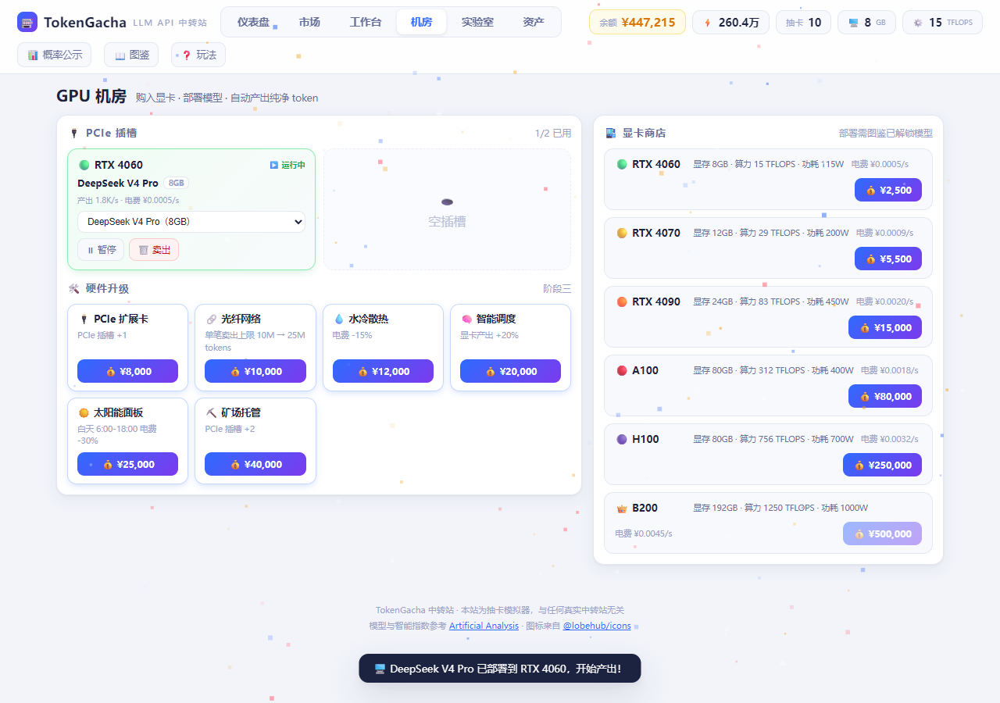

# 🎰 TokenGacha · LLM API Idle Game

**一家"神秘"的 LLM API 中转站模拟器。** 从手写代码白手起家，五阶段并行叠加，最终研发出自己的 AGI：

🔨 手写代码 → 🤖 AI 接单 → 🖥️ GPU 机房 → 🔬 模型研发 → 🧠 AGI 之路（通关解锁沙盒）

**🔗 在线试玩 / Play Now: https://endcreeper861.github.io/TokenGacha**

<p align="center">
  
</p>
<p align="center">
  
  
  
</p>

## 玩法

- 🎰 **抽卡**：三个卡池（青铜/白银/王者），单抽与十连，保底机制，翻卡动画与粒子特效
- 📊 **35 个真实模型**：稀有度按 [Artificial Analysis 智能指数](https://artificialanalysis.ai/leaderboards/models) 分档，图标来自 [@lobehub/icons](https://lobehub.com/icons)
- 💼 **接单**：三档工作（小/中/大单）+ token 品质系统（盲盒 60%~100% / 官方 95% / 自产 100%）+ 177 条终端文本
- ⌨️ **点击器**：工作台按任意字母或空格推进"手写代码"进度，5 项工具链升级
- 📦 **自动订阅**：解锁自动化调度后按每秒 5 个大单自动补货（单据消耗随 LRU 等升级动态变化）
- 🖥️ **机房**：六档显卡（RTX 4060 → B200），部署模型自动产出纯净 token，限时市场事件
- 🔬 **实验室**：三档研究员 + 边际递减 + 灵感迸发，研发出超级模型 AGI-X
- 🧠 **AGI 之路**：九项技术树 + AGI 研究点（RP）+ 最终协议 → 通关并解锁沙盒模式
- 💰 成就里程碑、分享战绩卡片、充值作弊模式

## 运行

零依赖静态站，三种方式任选：

```bash
# 1. 直接双击 index.html（file:// 可用）
# 2. 本机起个静态服务
python -m http.server 8017
# 3. 部署到任意静态托管（GitHub Pages 已部署）
```

存档使用 `localStorage` 键 `tokengacha_v3`（当前 ver=6，v4/v5 自动迁移）。控制台调试钩子：`window.TG`（`S` 实时状态 / `addMoney` / `addRp` / `skipTo` / `save`）。

## 自动化验收测试

仓库内附一个基于 **puppeteer-core + Edge** 的端到端冒烟脚本 `smoke-final.js`：从页面加载、点击器、抽卡、购买 token、自动订阅、买卡部署、雇佣研究员、技术树，一路跑到 AGI 通关 + 沙盒 + 存档往返，共 **46 项断言**。

```bash
npm i puppeteer-core
python -m http.server 8017          # 脚本默认访问 http://127.0.0.1:8017/index.html
node smoke-final.js                 # 输出逐项 PASS/FAIL 与汇总，并落一张整页截图
```

最近一次在本地版本上运行：**46/46 通过**，无非 favicon 的失败请求。

## 项目结构

| 路径 | 职责 |
|------|------|
| `index.html` | 页面骨架：六页导航（仪表盘/市场/工作台/机房/实验室/资产）+ 抽卡浮层 + 弹窗 |
| `css/style.css` | 全部样式：布局、组件、移动端适配、粒子与动画特效 |
| `js/data/` | 数据常量：models / gacha（卡池·经济·品质·工作档位）/ texts / upgrades / gpus / techs |
| `js/core/` | 核心：util / audio / fx（粒子）/ state（存档迁移）/ loop（1s tick 引擎 + dev 钩子） |
| `js/game/` | 玩法逻辑：gacha / market / gpu / research / tech / clicker / work / autobuy / stage |
| `js/ui/` | 界面：router / pages / dashboard / modals / share |
| `js/app.js` | 入口：事件绑定 + 启动引导 |
| `docs/README_详细.md` | 更详细的功能与结构说明 |
| `SPEC.md` / `plan.md` | 增量游戏改造的设计规格与实施计划 |

架构要点：普通 `<script>` 按序加载 + 全局变量（保住 `file://` 直接打开的能力，不引入打包器）；中央 `setInterval(1s)` 结算经济，tick 只做局部 `renderDynamic()`，仅在购买/解锁等离散事件时整页重绘。

> ⚠️ `js/` 下另有一份历史遗留的重复副本 `js/js/`（未被任何页面引用），清理前请先确认无本地分支依赖。

## 来源与致谢

本项目基于 [Animnia/TokenGacha](https://github.com/Animnia/TokenGacha) 起步，本仓库在其上完成了增量游戏改造（五阶段、自动订阅、技术树、机房、实验室等）与自动化冒烟测试。原始项目的贡献者一并致谢。许可证：Apache-2.0（见 `LICENSE`）。

---

# 🎰 TokenGacha · LLM API Idle Game (English)

A browser idle game that simulates running a "mysterious" LLM API relay station: start from hand-writing code and work your way up to building your own AGI across five stacking stages.

**🔗 Play Now: https://endcreeper861.github.io/TokenGacha**

- 🎰 3 card pools, single/×10 pulls, pity system, card-flip animations
- 📊 35 real-world models, rarity tiered by the Artificial Analysis Intelligence Index
- 💼 3 work tiers + token-quality system + 177 terminal flavor lines
- 🖥️ 6 GPU tiers (RTX 4060 → B200) that auto-produce tokens, plus timed market events
- 🔬 3 researcher tiers with diminishing returns → research the AGI-X supermodel
- 🧠 9-node tech tree + AGI research points → completion and sandbox mode
- 📦 Zero-dependency static trio (`index.html` + `css/` + `js/`); `file://` works
- ✅ `smoke-final.js`: 46-assertion end-to-end smoke test (puppeteer-core + Edge) from first click to AGI completion and save round-trip

Start here: `npm i puppeteer-core && python -m http.server 8017 && node smoke-final.js`

Based on the original [Animnia/TokenGacha](https://github.com/Animnia/TokenGacha); Apache-2.0.
